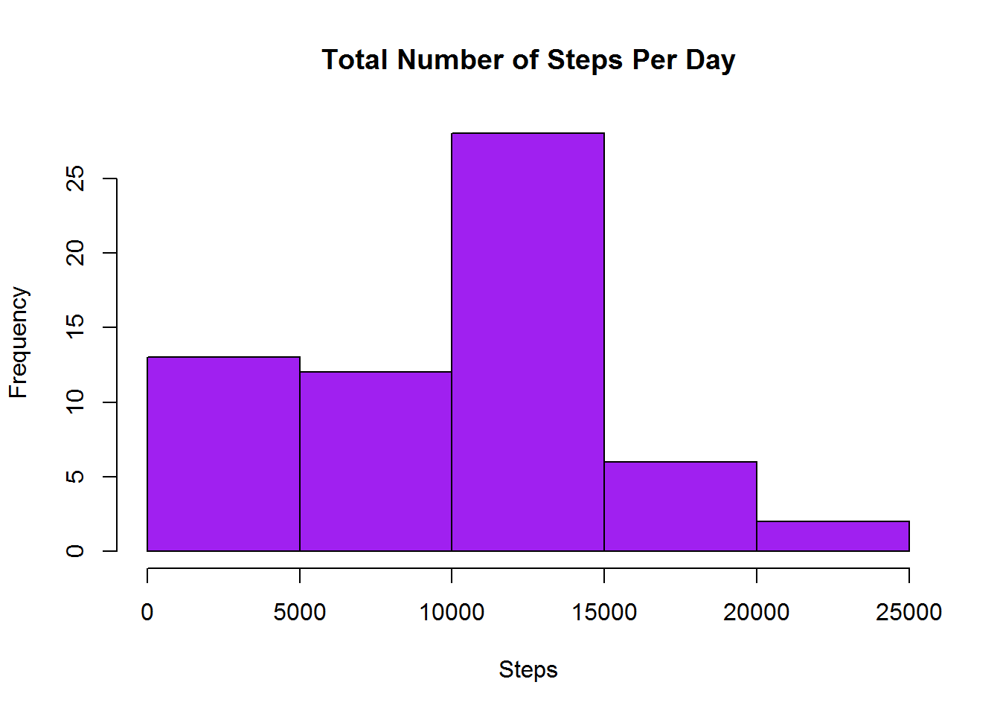
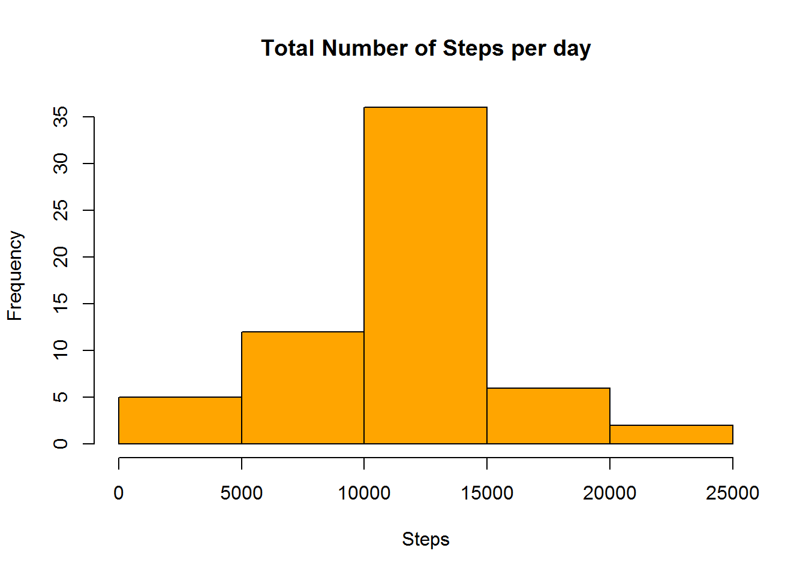

### Objective

The purpose of this project was to explore the daily personal activity collected from a wearable monitoring device, in order to examine behavioural patterns and trends in activity over time.


Please reference the link below for the dataset:

https://d396qusza40orc.cloudfront.net/repdata%2Fdata%2Factivity.zip

#### Install/load the required packages needed for the assignment
```{r, echo=TRUE}
library(dplyr)
library(ggplot2)
```

#### Load and pre-process the Activity Monitoring Data 
```{r, echo=TRUE}
activity<-read.csv("C:/Users/aao1009/Desktop/activity.csv")
head(activity)
str(activity)
class(activity$date)
activity$date<-as.Date(activity$date)
total_steps<-with(activity, tapply(steps, date, sum, na.rm = TRUE))
```

#### Histogram of the total number of steps taken each day
```{r, echo=TRUE}
hist1<-hist(total_steps, main="Total Number of Steps Per Day", xlab = "Steps", col = "purple")
```
 

#### Mean and median number of steps taken each day
```{r, echo=TRUE}
mean_total_steps<-mean(total_steps)
mean_total_steps
median_total_steps<-median(total_steps)
median_total_steps
```

#### Time series plot of the average number of steps taken
```{r, echo=TRUE}
avg_steps_interval<-with(activity, tapply(steps, interval, mean, na.rm=TRUE))
head(avg_steps_interval,10)
plot(avg_steps_interval,axes = F, type="l", col="purple", xlab="Time", ylab="Average Number of Steps", main="Average Daily Activity Pattern")
axis(1, at=c(0, 36, 72, 108, 144, 180, 216, 252, 288), label = c("0:00", "3:00","6:00", "9:00", "12:00","15:00","18:00","21:00","24:00"))
axis(2)
```


#### 5-minute interval containing the maximum number of steps
```{r, echo=TRUE}
max_steps<-which.max(avg_steps_interval)
max_steps
```
### Code describing and showing a stategy for imputing missing data

#### Total number of missing values in the dataset (total numebr of rows with missing data)
```{r, echo=TRUE}
activity_null_count<-sum(is.na(activity$steps))
activity_null_count
```

#### Re-populating the dataset by imputing the missing values 
```{r, echo=TRUE}
imputed<-activity
missing<-is.na(imputed$steps)
mean_int<-tapply(imputed$steps, imputed$interval, mean, na.rm = TRUE, simplify = TRUE)
imputed$steps[missing]<-mean_int[as.character(imputed$interval[missing])]
total_steps2<-with(imputed, tapply(steps, date, sum, na.rm = TRUE))
```

The missing values were imputed using the mean for the 5-minute interval.

#### Histogram of the total number of steps taken each day after missing values are imputed
```{r, echo=TRUE}
hist2<-hist(total_steps2, main="Total Number of Steps per day", xlab = "Steps", col = "orange")
```
 

#### Mean and median number of steps taken each day
```{r, echo=TRUE}
mean_total_steps2<-mean(total_steps2)
mean_total_steps2
median_total_steps2<-median(total_steps2)
median_total_steps2
```

#### Change in median and mean values after imputation
```{r, echo=TRUE}
diffinmean<-mean_total_steps-mean_total_steps2
diffinmean
diffinmedian<-median_total_steps-median_total_steps2
diffinmedian
```

The mean and median values for the number of steps taken each day differ from the initial analysis where the missing values were not imputed.Prior to imputation, the mean and median values were 9354 and 10395 respectively.Whereas after the missing values were imputed, the mean and median values were equal to 10766 and sigificantly greater than the values reported previously.

#### Activity patterns weekdays vs weekends
```{r, echo=TRUE}
imputed$weekdays<-weekdays(imputed$date)
imputed$day<-ifelse(imputed$weekdays%in%c("Saturday","Sunday"), "Weekend", "Weekday")
weekdaytypesteps<-aggregate(steps~interval+day,data=imputed,mean)
```

#### A panel plot comparing weekday and weekend activity
```{r, echo=TRUE}
g1<-ggplot(weekdaytypesteps, aes(interval, steps))
g1 + geom_line() +
        facet_grid(day ~ .) +
        xlab("5-minute Interval") + 
        ylab("Number of Steps")
```


### Conclusion

Imputation of the missing values had a significant effect on the mean and median numer of steps taken each day, affecting the overall distribution. Furthermore, greater overall activity pattern was observed over the weekend, with an exception of the subject being more active earlier in the day during the weekdays.This behavioural pattern could probably be attributed to an average adult's lifestyle, in which we have work during the day and more of a flexible schedule over the weekend that allows us to incorporate other activities.

